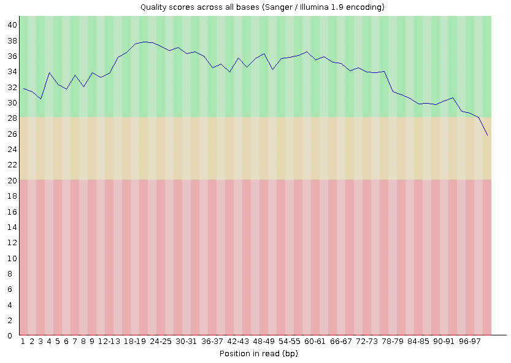

# trimming_raw_reads
Orientation to raw read trimming for advanced bioinformatics course at Utah Tech University

---

# Contents

-   [Objectives](#objectives)
-   [Genomic Filetypes](#genomic-filetypes)
-   [Basic Processing Steps](#basic-processing-steps)
-   [Exercise](#exercise)

---

# <a name="objectives"></a>
# Objectives

-  Understand why trimming is an important part of bioinformatics pipelines
-  Understand the file conversions
---

# <a name="getting-set-up"></a>
# Getting set up
If you are here as a UTU student taking BIOL 4300, you should do the following:

1.  Login to your [Github](https://github.com/) account.

1.  Fork [this repository](https://github.com/KLab-UT/trimming_raw_reads), by
    clicking the 'Fork' button on the upper right of the page.

    After a few seconds, you should be looking at *your*
    copy of the repo in your own Github account.

1.  Click the 'Clone or download' button, and copy the URL of the repo via the
    'copy to clipboard' button. **note: if you have an SSH key with your github account, make sure you select the ```SSH``` tab**

1.  Login to the lonepeak cluster (CHPC) from your terminal

1.  On your lonepeak login node, navigate to where you want to keep this repo (
    I recommend having an exercise folder where you can clone repositories for the
    coding exercises). Then type:

        $ git clone the-url-you-just-copied

    and hit enter to clone the repository. Make sure you are cloning **your**
    fork of this repo.

1.  Next, `cd` into the directory:

        $ cd the-name-of-directory-you-just-cloned

1.  At this point, you should be in your own local copy of the repository.

    As you work on the exercise below, be sure to frequently `commit` your work
    and `push` changes to the *remote* copy of the repo hosted on Github.
---

# <a name="what-is-trimming"></a>
# What is trimming?

Raw reads generated from a high-throughput sequencer are stored within the fastq filetype (see the [genomics pipeline intro repository](https://github.com/rklabacka/genomics-pipeline-intro) for details about fastq files). These reads are called "raw" because they have not been adjusted for quality control (e.g., removing sequence with low confidence and removing the adapter sequence used for library preparation).

There are multiple ways to examine the quality of your reads and then perform read cleaning (trimming). We will examine a few bioinformatics packages in this overview, but many other exist that can perform the same or similar tasks.

# Quality check

Before trimming your data, it may be helpful to examine the quality of your reads as a whole. You can perform a quality check using the software package 'fastqc'. This will generate a set of results that can provide quick insight into the quality of your data. You can visualize the results using an html interpreter (e.g., a web browser). For example, copy the file 'SRR11621811_fastqc.zip' to your personal desktop for visualization on a web browser. You can perform a quality check and then visualize the results by performing the following commands:

While on the CHPC in this repository:
```
module load fastqc/0.11.4
fastqc example_raw.fastq
```

Then from your local environment (not from the CHPC terminal window):

```
scp <uNID>@lonepeak.chpc.utah.edu:<path-to-repository>/example_raw_fastqc.zip .
unzip example_raw_fastqc.zip
cd example_raw_fastqc
open fastqc_raw_report.html
```
> note: scp is a way to securely copy a file. The first parameter is the path to the remote file. The second parameter is the path to the destination location (in this scenario we just used the current directory ```.```)
> note: The ```.``` at the end of your scp command means the file you are copying will land in the directory you are in.

At the top of the page, you should see information about the 'Basic statistics' for your reads in the file example_raw.fastq. You have 25 total sequences in this file, each of which is of length 100 bp. If you look at the example_raw.fastq file (e.g., ```less example_raw.fastq```), you'll see that each read is 100 bp in length (this is your read length).

Under this, you should see a section called 'Per base sequencing quality' with a plot that looks like this:



This shows you the average quality score for your reads at each position. On this plot, each column represents base position (1-100). Each column also has a value represented by the blue line. This is your average score at that position across your reads. Most of the reads start off strong (Phred score > 30), but then they taper toward the end where the score drops beneath the standard threshold of 30. The base calls with scores less than 30 should be trimmed (removed).
> note: We chose '30' as our cutoff. However, the cutoff you choose may be different. You need to decide based on the needs of your project what your cutoff is going to be.


# Trimming

To trim our reads, we will use the program 'fastp'. The syntax for this program is described in their [documentation](https://github.com/OpenGene/fastp). Execute the following command to trim reads within the file ```example_raw.fastq```:

```
module load fastp/0.20.1
fastp \
  -i example_raw.fastq \
  -q 15 \
  -u 40 \
  -e 30 \
  -l 15 \
  -a AGATCGGAAGAGCACACGTCTGAACTCCAGTCA \
  -M 25 \
  -W 5  \
  -5 \
  -3 \
  -o example_cleaned.fastq
```

Information on what the options for this program do is provided in the table below. You can see all fastp options by running ```fastp -h```


| Flag                   |  Full option                            | Description                                                              | Default |
|:----------------------:|:---------------------------------------:|:------------------------------------------------------------------------:|:-------:|
|  ```-i``` and ```-I``` |  ```--in1``` and ```--in2```            | Infile(s) (plural if paired-end reads)                                   | NA      |
|  ```-q```              |  ```--qualified_quality_phred```        | The threshold for qualifying ```a``` base                                | 15      |
|  ```-u```              |  ```--unqualified_percent_limit```      | Reads with ```u```% bases under ```q``` value are discarded              | 40      |
|  ```-e```              |  ```--average_qual```                   | Reads with average quality of ```e``` are discarded                      | 0       |
|  ```-l```              |  ```--length_required```                | Reads with length (after filtering) < ```l``` are discarded              | 15      |
|  ```-a```              |  ```--adapter_sequence```               | The nucleotide sequence for the adapter** used for sequencing            | *       |
|                        |  ```--adapter_sequence_r2```            | The adapter sequence** for read 2 in paired-end sequencing               | *       |
|  ```-M```              |  ```--cut_mean_quality```               | The minimum average in a sliding window to not remove bases              | 20      |
|  ```-W```              |  ```--cut_window_size```                | The number of bases in a sliding window                                  | 4       |
|  ```-5```              |  ```--cut_front```                      | Use sliding window to trim leading sequences with averages < ```M```     | OFF     |
|  ```-3```              |  ```--cut_tail```                       | Use sliding window to trim trailing sequences with averages < ```M```    | OFF     |
|  ```-c```              |  ```--correction```                     | Overlap analysis to correct bases with low reads (only for PE reads)     | OFF     |
|  ```-m```              |  ```--merged```	                   | Merge paired-end reads that overlap into a single read                   | OFF     |
|                        |  ```--merged_out```                     | Filename for storing merged reads                                        | NA      |
|  ```-o``` and ```-O``` |  ```--out1``` and ```out2```            | Filenames for unmerged reads that passed trimming filters                | NA      |
|                        |  ```--unpaired1``` and ```unpaired2```  | Filenames for reads that can't be merged because one didn't pass filters | NA      |
|                |  ```--dedup```                          | Duplicate reads\*\*\* (reads with the exact same sequence) are removed   | ON      |
##### \* If no adapter sequence is specified, the adapter sequence is intuited by fastp (which is faster, but can be inaccurate)
##### \*\* The TruSeq adapter sequences are ```AGATCGGAAGAGCACACGTCTGAACTCCAGTCA``` (for read 1) and ```AGATCGGAAGAGCGTCGTGTAGGGAAAGAGTGT``` (for read2). 
##### \*\*\* This is to remove PCR duplicates, however this feature is only available in fastp versions after 0.22

You'll notice that many of the options in this table aren't implemented in your command above. One reason for this is because the example_raw.fastq contains reads from single-end (SE) sequencing. Options such as ```--in2```, ```adapter_sequence_r2```, ```--correction```, ```--merged``` are specific to paired-end (PE) sequencing.

You can also split the output files into multiple fastq files, which can be helpful if you plan to do mapping in parallel. This options to create 3 output files for a single individual is shown below (we don't include it in this example, but it would decrease downstream processing time).
```fastp --split_prefix_digits=4 --out1=out.fq --split=3```

When you run fastp, information about the results is printed to stdout (printed to your terminal window in our example above). We see that our file started with 25 reads, and after filtering we end up with 21 reads. Although we reduced the number of reads, you'll see that the quality of our reads increased. FOr instance, the percentage of bases with a PHRED score of at least 20 (meaning an accuracy of 99%) increased from 91.68% to 98.65%. Likewise, the percentage of bases with a quality score of at least 30 (meaning an accuracy of 99.9%) increased from 85.36% to 92.91%.

We can also see that we have a new file called "example_cleaned.fastq". This file is smaller (5413) than the "example_raw.fastq" file (6510), due to the reduction in data from quality filtering.

You can now run fastqc on your cleaned data:

```
fastqc example_raw.fastq
```

What do you notice that is different about your data?

# <a name="exercise"></a>
# Exercise
The basic workflow for cleaning reads in this exercise reflects that from [Farkas et al., 2021](https://doi.org/10.3389/fmicb.2021.665041).

## Exercise Objective
Download and clean raw reads from human tumor liver tissue. Compare the reads from before cleaning to those after cleaning. 

To complete this exercise, complete the following steps and answer the questions contained within the worksheet.md file. 

## Run the bash script to download and clean raw reads
From the repository directory (where this README is stored), move into the ```bash_scripts``` directory.

```cd bash_scripts```

Here you'll see two bash files: "q.main.sh" and "tri_raw_reads.sh". The "q.main.sh" file is a batch script that provides run information to slurm, and the "trim_raw_reads.sh" file processes RNA seq data (qc and cleaning). **You need to look at the "q.main.sh" file and make sure the paths are correct for your repository**. For example, the path in the original file will look like this:

```
wd=~/BIOL_4310/Exercises/Exercise_4/trimming_raw_reads
```

If you set up the path to your repository on your login node differently than this, then you will need to edit that line of code.

Once you have the paths correct, from the ```bash_scripts``` directory move back into the parent directory.

```
cd ..
```

Now run the following command (**on the CHPC (NOT your local machine)**):


```
sbatch bash_scripts/q.main.sh
```

You should understand what is going on in both the q.main.sh and trim_raw_reads.sh files. While you may be unfamiliar with some components, identify items that are familiar and seek to understand what those commands are doing.

## Remix 1: Modify a trimming parameter
Once your run has ran to completion, modify a parameter for fastp. You can change any parameter, but just choose one thing.

You will make these changes to the "trim_raw_reads.sh" file and re-run the "q.main.sh" batch script. To make sure you don't overwrite your files from the previous run, I recommend changing the directory names to include ```remix1``` (**you only need to do this for the cleaned_reads directories. You should not re-download, re-fastq-dump, or re-qc the raw_reads. In other words, you should rename the directories in lines 37 and 38 and comment out lines 39 - 76. Alternatively, you could just make a new script and call it from q.main.sh**)

## Remix 2: Modify a DIFFERENT trimming parameter
Once your run has ran to completion, modify a parameter for fastp. You can change any parameter, but just choose one thing.

Once again, you will make these changes to the "trim_raw_reads.sh" file and re-run the "q.main.sh" batch script. To make sure you don't overwrite your files from the previous run, I recommend changing the directory names to include ```remix1``` (**you only need to do this for the cleaned_reads directories. You should not re-download, re-fastq-dump, or re-qc the raw_reads. In other words, you should rename the directories in lines 35 and 36 and comment out lines 38 - 70. Alternatively, you could just make a new script and call it from q.main.sh**)

Now compare the output of your cleaning runs. Add your insight to the worksheet. Once you have completed the worksheet, add, commit, and push the worksheet and the logfile to your forked repository.

```
add worksheet.md logfile
# Make sure you don't add all of the genomic files, just the worksheet.md
# The .gitignore includes the genomic files, so they won't be added by default
git commit -m "ran script and answered worksheet questions"
git push
```

